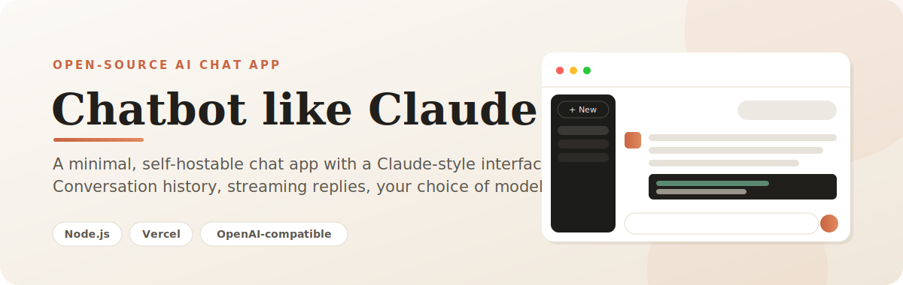

<p align="center"></p>

<p align="center">
  
  
  
  
</p>

<p align="center">
  A self-hostable, Claude-style AI chat web app. Vanilla HTML/CSS/JS frontend with <strong>zero build step</strong>, a Node.js backend, and seven swappable AI providers behind one clean interface.
</p>

<p align="center">
  <a href="https://chatbot-like-claude.vercel.app"><strong>Live Demo</strong></a>
  &nbsp;·&nbsp;
  <a href="https://github.com/hammadshakeelai/chatbot-like-claude"><strong>Source</strong></a>
</p>

---

## ✨ Features

- **💬 Streaming chat with a Claude-style UI** — A dark sidebar with saved conversations (persisted to `localStorage`) and auto-generated conversation titles, markdown rendering with copy buttons on every code block, per-message actions (Copy / Read aloud / Regenerate), example prompts to get started, toast notifications, and a stop-generation button so you stay in control of every response.

- **🔀 Seven selectable AI models** — Switch providers from a dropdown, each defaulting to its **best-quality** model:

  | Provider | Default model |
  |---|---|
  | Groq | GPT-OSS 120B |
  | Cerebras | GPT-OSS 120B |
  | OpenRouter | DeepSeek V3 |
  | Mistral | Large |
  | Fireworks | DeepSeek V4 Pro |
  | OpenCode Zen | Nemotron Ultra |
  | Gemini | 3.1 Pro |

- **⚡ Fast mode toggle** — Flip a single switch to swap every provider over to a quicker, lighter model whenever speed matters more than depth.

- **🛟 Resilience built in** — Automatic multi-key failover (e.g. several Gemini keys rotate on `429` quota errors) plus cross-provider fallback to Groq if the chosen provider is fully unavailable. When the server switches on your behalf, it tells the UI via an `X-Provider` response header.

- **🎤 Voice input** — Dictate messages straight into the composer, transcribed by Groq Whisper (`whisper-large-v3-turbo`).

- **🖼️ Vision** — Attach an image and ask questions about it (Llama 4 Scout via Groq, with Mistral Pixtral as a fallback).

- **🎨 Image generation** — Type `/image <prompt>` to generate pictures. A 3-tier fallback keeps it working: OpenRouter image model → Gemini native image (with key failover) → AI Horde (free, keyless; returned as a pending job the browser polls, so it never blocks the serverless time limit).

- **🔊 Read aloud with emotion** — Assistant replies can be spoken via ElevenLabs TTS. The backend detects the emotional tone of the text (excited, cheerful, empathetic, sad, serious, calm, neutral) and tunes the voice delivery to match — and shows the detected tone in the UI.

- **🔒 Security first** — Every API key lives only in server-side environment variables (a git-ignored local `.env`, plus Vercel env vars in production). Keys are **never** in client code or committed to the repo. The browser never sees a key.

---

## 🧰 Tech Stack

**Vanilla HTML/CSS/JS** · **Node.js** (Express dev server + Vercel serverless functions) · **OpenAI-compatible chat APIs** · **ElevenLabs** (TTS) · **AI Horde** (free image fallback)

---

## 🚀 Quick Start (local)

```bash
git clone https://github.com/hammadshakeelai/chatbot-like-claude
cd chatbot-like-claude
npm install
cp .env.example .env   # then add at least GROQ_API_KEY
npm start              # http://localhost:3000
```

That's it — no bundler, no build step. Open <http://localhost:3000> and start chatting.

---

## ⚙️ Configuration

All secrets live in your `.env` file. **Only the providers you actually want to use need a value** — leave the rest blank and the app simply won't offer them.

| Variable | Purpose |
|---|---|
| `PROVIDER` | Default chat provider (default: `groq`) |
| `GROQ_API_KEY` | Groq chat — also powers voice/Whisper, vision, and auto-titles |
| `OPENROUTER_API_KEY` | OpenRouter chat — also powers image generation |
| `OPENROUTER_API_KEY_2` | Additional OpenRouter key for automatic failover |
| `CEREBRAS_API_KEY` | Cerebras chat |
| `MISTRAL_API_KEY` | Mistral chat — also the vision fallback |
| `FIREWORKS_API_KEY` | Fireworks chat |
| `OPENCODE_API_KEY` | OpenCode Zen chat |
| `GEMINI_API_KEY` | Gemini chat and native image generation |
| `GEMINI_API_KEY_2 … _N` | Extra Gemini keys for automatic failover (the free tier is quota-limited) |
| `GEMINI_API_KEYS` | Alternative: comma-separated list, e.g. `a,b,c` |
| `ELEVENLABS_API_KEY` | Read-aloud (TTS) |
| `ELEVENLABS_VOICE_ID` | The ElevenLabs voice to speak with |

Example `.env`:

```bash
PROVIDER=groq
GROQ_API_KEY=your-key-here
OPENROUTER_API_KEY=your-key-here
GEMINI_API_KEY=your-key-here
GEMINI_API_KEYS=your-key-here,your-second-key-here
ELEVENLABS_API_KEY=your-key-here
ELEVENLABS_VOICE_ID=your-voice-id-here
```

### 🔁 Failover convention

Any provider supports multiple keys for automatic rotation on quota/rate-limit errors. Three interchangeable forms:

- `NAME` — a single key
- `NAME_2`, `NAME_3`, … `NAME_9` — numbered keys, tried in order
- `NAMES=comma,separated,keys` — a comma-separated list

For example, `GROQ_API_KEY`, `GROQ_API_KEY_2`, or `GROQ_API_KEYS=a,b,c` all work.

---

## ▲ Deploy to Vercel

```bash
npm i -g vercel
vercel deploy --prod
```

Then set the same environment variables under **Vercel → Project → Settings → Environment Variables**.

- `public/` is served as static assets.
- `api/*.js` run as serverless functions.

---

## 📁 Project Structure

```
.
├── api/                  Vercel serverless functions
│   ├── chat.js           Streaming chat (multi-provider, failover)
│   ├── transcribe.js     Voice → text (Whisper)
│   ├── speak.js          Text → speech (ElevenLabs, emotion-aware)
│   ├── image.js          Image generation (3-tier fallback)
│   ├── image-status.js   Poll endpoint for async image jobs
│   └── title.js          Auto conversation titles
├── lib/
│   ├── providers.js      Provider registry, model selection, key failover
│   └── handlers.js       Shared request handlers (used by api/ and server.js)
├── public/
│   ├── index.html
│   ├── styles.css
│   └── app.js            Sidebar, streaming, voice, vision, image, read-aloud
├── assets/banner.svg
├── server.js             Local dev server (Express) — same handlers
├── vercel.json
└── .env.example
```

The same shared handlers in `lib/handlers.js` back both the Express dev server (`server.js`) and the Vercel serverless functions in `api/`, so local and production behavior stay in lockstep.

---

## 🔒 Security

Every API key lives **only** in server-side environment variables — a git-ignored local `.env` for development and Vercel environment variables in production. Keys are never embedded in client code and never committed to the repository. The browser never receives a key; all provider requests are proxied through the backend.

---

## 📄 License

Released under the [MIT License](LICENSE).
